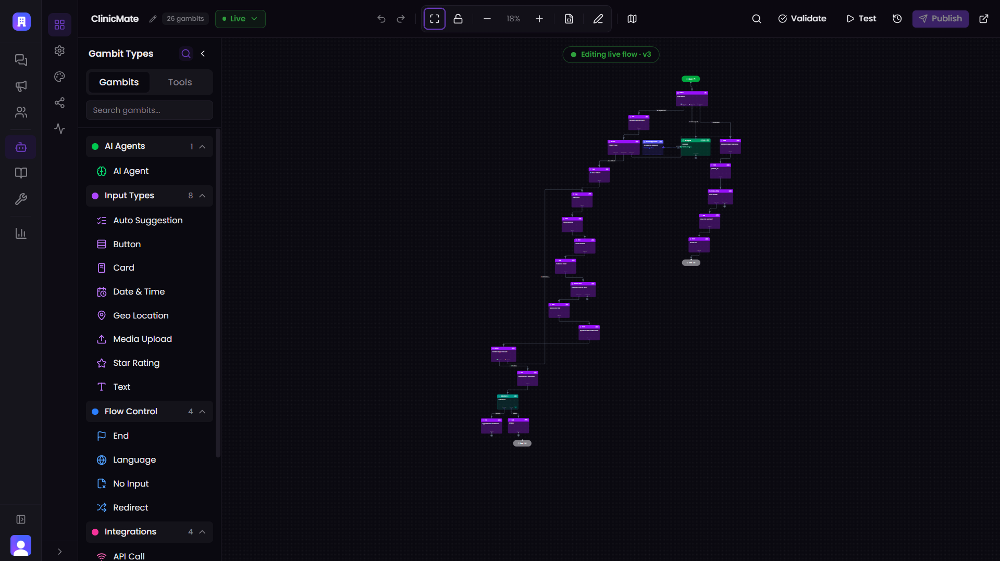
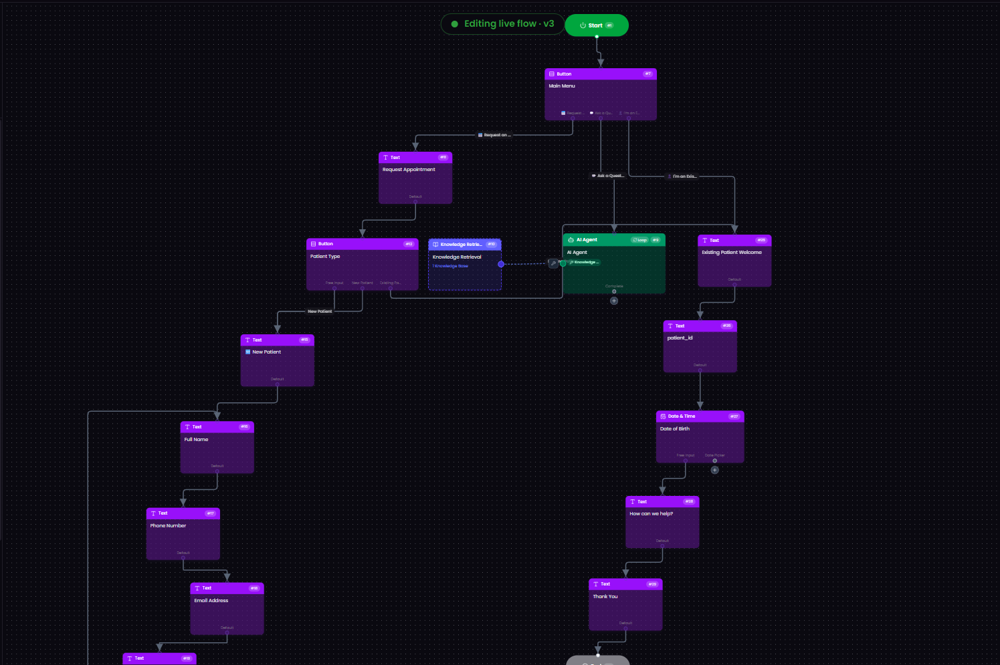
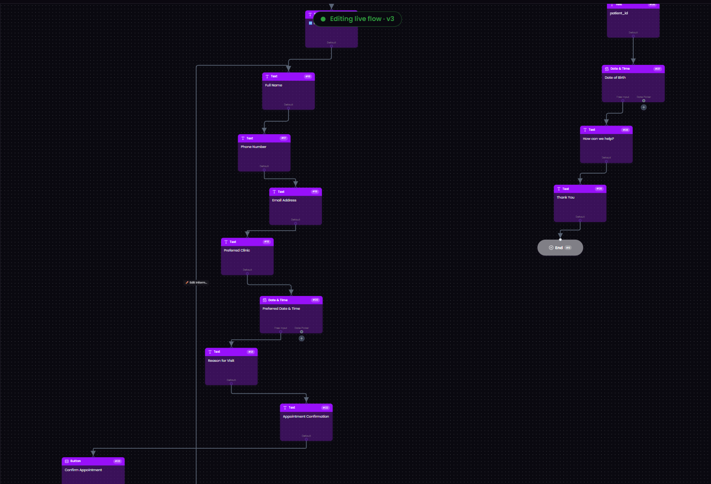
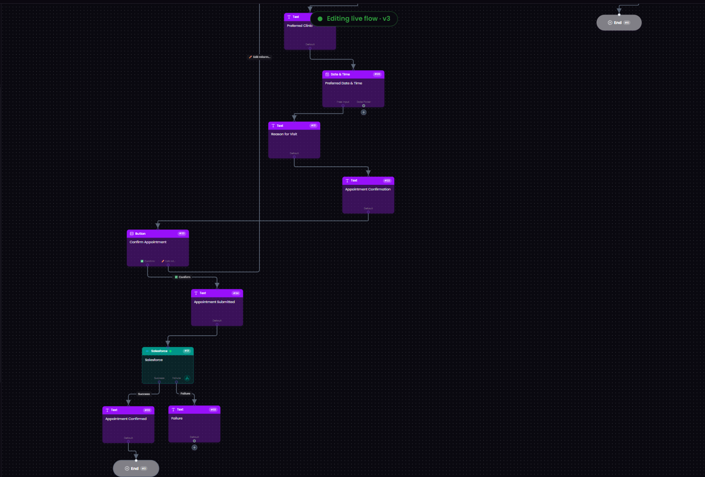
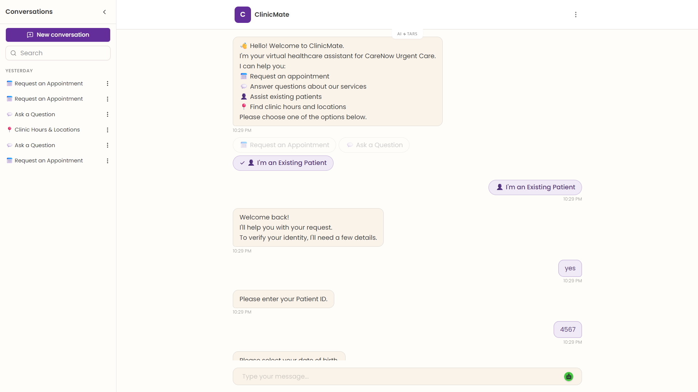

# 🏥 ClinicMate – AI Healthcare Assistant

> AI-powered Healthcare Assistant built using the **TARS AI Agent Platform**.

> Independently designed and built as part of the **TARS Implementation Engineer Technical Assessment (July–August 2026).**

---

## 🌐 Live Demo

🔗 https://neoagent.hellotars.com/chat/fcNwzt5z

---

## 📖 Overview

ClinicMate is an AI-powered healthcare assistant that helps patients find healthcare information, answer common questions, and request appointments through an intelligent conversational interface.

The assistant was built using the **TARS AI Agent Platform** with a strong focus on conversational AI, user experience, and structured workflow design.

---

## ✨ Features

- Answer patient queries using a knowledge base
- Distinguish between new and existing patients
- Collect appointment requests through guided workflows
- Personalize conversations based on patient type
- Capture patient information using branching logic
- Support intelligent lead capture workflows
- Deliver a responsive conversational experience

---

## 🛠 Tech Stack

- TARS AI Agent Platform
- Conversational AI
- Prompt Engineering
- Workflow Design
- Knowledge Base

---

## 📸 Screenshots

### Workflow Overview

---

### Main Conversation Flow

---

### Appointment Request Flow

---

### Salesforce Integration Workflow

---

### Live Conversation

---

## ⚠️ Limitations

The original assignment required Salesforce Lead and Task creation.

The workflow includes a Salesforce integration node; however, live Lead creation could not be completed because authenticated Salesforce API credentials were unavailable during the assessment.

---

## 📄 Assignment Context

This project was independently developed as part of the first-round technical assessment for the **TARS Implementation Engineer Internship**.

The objective was to design an AI-powered healthcare assistant capable of:

- Answering patient questions
- Identifying new and existing patients
- Capturing appointment requests
- Demonstrating conversational workflow design

---

## 🚀 Future Improvements

- Salesforce CRM Integration
- Calendar & Appointment Scheduling
- Multi-language Support
- Analytics Dashboard
- WhatsApp Integration

---

## 👨‍💻 Author

**Vivek Bhattacharya**

GitHub: https://github.com/vivekbhattacharya01-gif

LinkedIn: https://linkedin.com/in/vivek-bhattacharya-9a661528a
